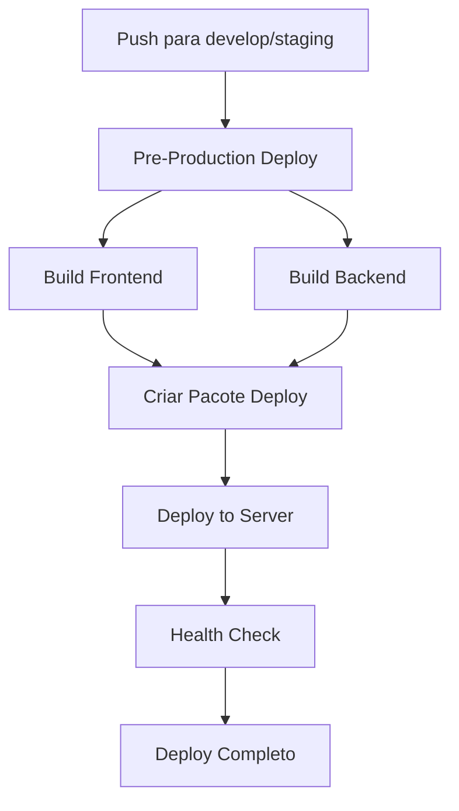

# 🚀 GitHub Actions - Pre-Production Deployment

Este repositório inclui workflows do GitHub Actions para automatizar o deploy em ambiente de pré-produção.

## 📋 Workflows Disponíveis

### 1. **Pre-Production Deploy** (`pre-production.yml`)
- **Trigger**: Push para branches `develop` ou `staging`, ou execução manual
- **Função**: Build do frontend e backend, testes, e criação do pacote de deploy
- **Artefatos**: Pacote completo de deploy com configurações PM2 e Docker

### 2. **Deploy to Pre-Production Server** (`deploy-preprod.yml`)
- **Trigger**: Após sucesso do workflow "Pre-Production Deploy"
- **Função**: Deploy automático no servidor de pré-produção via SSH
- **Requisitos**: Configuração de secrets SSH

### 3. **Setup Pre-Production Environment** (`setup-preprod.yml`)
- **Trigger**: Execução manual
- **Função**: Scripts para configurar servidor de pré-produção
- **Inclui**: Instalação de dependências, configuração de banco, nginx, etc.

## 🛠️ Configuração Inicial

### 1. Configurar Secrets do GitHub

Vá em **Settings > Secrets and variables > Actions** e adicione:

```
SSH_PRIVATE_KEY    # Sua chave privada SSH
SSH_USER          # Usuário SSH (ex: ubuntu)
SSH_HOST          # IP ou hostname do servidor
```

### 2. Configurar Branches

Os workflows estão configurados para as branches:
- `develop` - Deploy automático
- `staging` - Deploy automático
- `main` - Apenas build (sem deploy)

### 3. Configurar Servidor

Execute o workflow "Setup Pre-Production Environment" primeiro para configurar o servidor.

## 🚀 Como Usar

### Deploy Automático
1. Faça push para `develop` ou `staging`
2. O workflow será executado automaticamente
3. Acesse a aplicação em `http://seu-servidor:3001`

### Deploy Manual
1. Vá em **Actions > Pre-Production Deploy**
2. Clique em **Run workflow**
3. Selecione a branch desejada
4. Clique em **Run workflow**

### Setup de Servidor
1. Vá em **Actions > Setup Pre-Production Environment**
2. Clique em **Run workflow**
3. Configure os parâmetros do servidor
4. Execute o workflow

## 📊 Monitoramento

### Verificar Status
```bash
# No servidor
pm2 status
pm2 logs friendly-guacamole-preprod
```

### Health Check
```bash
curl http://seu-servidor:3001/api/validate_token
```

### Logs
- **PM2**: `pm2 logs`
- **Docker**: `docker-compose logs -f`
- **Arquivo**: `/opt/friendly-guacamole-preprod/logs/`

## 🔧 Configurações

### Portas
- **Aplicação**: 3001
- **Banco de Dados**: 5432
- **Nginx**: 80 (opcional)

### Variáveis de Ambiente
O arquivo `.env.example` é criado automaticamente com as configurações necessárias.

### Banco de Dados
- **Nome**: `friendly_guacamole_preprod`
- **Usuário**: `friendly_user`
- **Senha**: `secure_password` (altere em produção)

## 🐛 Troubleshooting

### Deploy Falhou
1. Verifique os logs do workflow
2. Confirme se os secrets SSH estão corretos
3. Verifique se o servidor está acessível

### Aplicação Não Inicia
1. Verifique as variáveis de ambiente
2. Confirme se o banco de dados está rodando
3. Verifique os logs da aplicação

### Health Check Falha
1. Verifique se a porta 3001 está aberta
2. Confirme se a aplicação está rodando
3. Verifique os logs de erro

## 📝 Notas Importantes

- **Segurança**: Altere todas as senhas padrão em produção
- **Backup**: Configure backup regular do banco de dados
- **SSL**: Configure HTTPS em produção
- **Monitoramento**: Configure alertas para falhas

## 🔄 Fluxo de Deploy



## 📞 Suporte

Para dúvidas ou problemas:
1. Verifique os logs do workflow
2. Consulte a documentação do projeto
3. Abra uma issue no repositório
